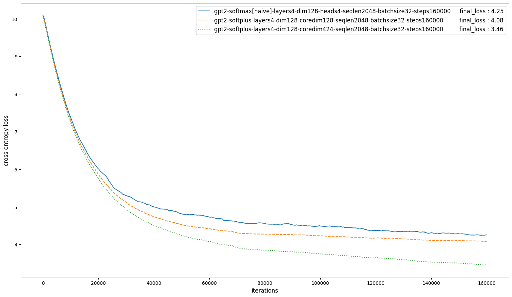

# GPT-2 for PyTorch

This repository contains a reimplementation of the GPT-2 model from OpenAI, found [here](https://openai.com/index/better-language-models/). 
It provides a script and recipe for **`pretraining`** and **`deploying`** the model. 
This repository was intended to illustrate the use of the compressed self-attention layer from the bluewalm module. 
The bluewalm module itself can be obtained from [here](https://www.bluewalm.com). 

This repository is tested and maintained by BLUEWALM. 

Table of Contents
=================
  * [Model overview](#model-overview)
  * [Implemented features](#implemented-features)
     * [Features](#features)
  * [Setup](#setup)
     * [Requirements](#requirements)
  * [Quick Start Guide](#quick-start-guide)
  * [Scripts](#scripts)
  * [Training Metrics (1x A100 40GB)](#training-metrics-1x-a100-40gb)
  * [Inference Metrics (1x A100 40GB)](#inference-metrics-1x-a100-40gb)
  * [Release notes](#release-notes)
     * [Changelog](#changelog)
     * [Known issues](#known-issues)


## Model overview

The GPT-2 model is one of the early large language models, one among those that started the revolutionary transformation of natural language processing and all of artifical intelligence the world has witnessed in the last years. 
Much progress was made since then and modern large language models are designed in a more efficient way. 
Thus, this repository has mainly historic and scientific value 
The description of the model and an example repository can be found [here](https://openai.com/index/better-language-models/). 

## Implemented features

The following features were implemented in this repository:
  * Automatic Mixed Precision (AMP) training
  * Fully-sharded data-parallel (FSDP) training
  * Gradient accumulation
  * TensorRT deployment

### Features

  * Automatic Mixed Precision (AMP) training - allows us to use BF16 or FP16 training with FP32 master weights. 
  * Fully-sharded data-parallel (FSDP) training - efficient way to use multiple GPUs for training. Training can be done in BF16 with FP32 gradient accumulation. 
  * Gradient accumulation - an efficient way to reduce the batch size (thus, the memory requirements) at the cost of more iterations. 
  * TensorRT deployment - a simple way to automatically transform the trained model into the highly efficient TensorRT format. 

## Setup

The following section lists the requirements in order to start training the GPT-2 model.

### Requirements

Make sure that you have the following components:
- [NVIDIA Docker](https://github.com/NVIDIA/nvidia-docker)
- PyTorch 25.03-py3+ NGC container
- GPU

For more information about how to get started with NGC containers, see the following sections from the NVIDIA GPU Cloud Documentation and the Deep Learning Documentation:
-   [Getting Started Using NVIDIA GPU Cloud](https://docs.nvidia.com/ngc/ngc-getting-started-guide/index.html)
-   [Accessing And Pulling From The NGC Container Registry](https://docs.nvidia.com/deeplearning/frameworks/user-guide/index.html#accessing_registry)

## Quick Start Guide

To train your model on the WikiPedia dataset perform the following steps. 

1. Obtain the bluewalm pytorch module from us. You can find us at [this place](https://www.bluewalm.com). 
Build the bluewalm Docker container with the Dockerfile obtained from us. 

2. Clone the repository. 
```bash
git clone https://github.com/bluewalm/gpt2_pyt.git
```

3. Now, enter the repository. 
```bash
cd gpt2_pyt
```

4. If you want to train the GPT-2 model with the new softplus attention, then skip this step. 
In case you want to train the GPT-2 model with the usual softmax attention, then switch to the previous commit with the following command. 
```bash
git checkout master~1
```

5. Now, enter the following repository. 
```bash
cd gpt2/data/preprocessing/
```

6. Run the following command to download and preprocess the WikiPedia dataset. This will take a while. 
```bash
docker run --rm --gpus device=all --net=host --shm-size=32gb --ulimit memlock=-1 --cap-add=SYS_ADMIN --ulimit stack=67108864 -v "${PWD}:/workspace" nvcr.io/nvidia/pytorch:24.11-py3 python preprocess_dataset.py
```
This command will launch a non-interactive, old pytorch container which (at the moment) has the appropriate dependencies for [wikinlp](https://github.com/possible-worlds-research/wikinlp). 
Within the container it will download and preprocess the dataset. 

7. Run the following command to split the preprocessed dataset into train and evaluation datasets. 
```bash
docker run --rm --gpus device=all --net=host --shm-size=32gb --ulimit memlock=-1 --cap-add=SYS_ADMIN --ulimit stack=67108864 -v "${PWD}:/workspace" nvcr.io/nvidia/pytorch:24.11-py3 bash split_the_wiki.sh
```
At this point the train dataset is found in the following folder: 
```gpt2_pyt/gpt2/data/preprocessing/pretrain_data/train/```
while the eval dataset is found in the following folder: 
```gpt2_pyt/gpt2/data/preprocessing/pretrain_data/eval/```

8. Now move up a few folders. 
```bash
cd ../../../../
```
You should be in the folder that contains the ```gpt2_pyt``` folder. 

9. Now move the dataset to a more appropriate place with the following commands. 
```bash
mkdir -p Datasets/WikiPedia
mv gpt2_pyt/gpt2/data/preprocessing/pretrain_data ./Datasets/WikiPedia/
```
Thus, the current folder should contain both the `Datasets` and `gpt2_pyt` folders. 

10. Start the bluewalm Docker container. 
```bash
docker run -it --rm --gpus device=all --net=host --shm-size=32gb --ulimit memlock=-1 --cap-add=SYS_ADMIN --ulimit stack=67108864 -v "${PWD}:/workspace" bluewalm_pyt:latest
```
This will launch an interactive container and mount the current directory as a volume to the `/workspace` directory inside the container. 
Any datasets, checkpoints and deployed models saved to `/workspace` will be accessible in the corresponding directory on the host. 
At this point, the `/workspace` folder inside the container should contain a `gpt2_pyt` folder and a `Datasets` folder. 

11. Move into the `gpt2_pyt` folder. 
```bash
cd gpt2_pyt
```

11. Train the tokenizer with the following command:
```bash
./train_tokenizer.sh
```
In order to set the size of the vocabulary, you will have to edit the shell script file. 
Training the tokenizer may take a while, especially the first few steps. 

12. Single-GPU training of the neural network can be started with the following command: 
```bash
./train_gpt2.sh
```
Multi-GPU training can be started with the following command: 
```bash
./multitrain_gpt2.sh
```

13. After training is done, evaluation on a (possibly partial) dataset can be run with the following command:
```bash
./eval_gpt2.sh
```
Evaluation on the entire eval dataset can take a while. 

14. Deployment into TensorRT format can be done with the following command: 
```bash
./deploy_gpt2.sh
```
This will also do accuracy checks and benchmark latency and throughput. 

15. In order to double-check that everything is in order, you may want to generate a few sentences with the trained model. 
The following command lets you do that: 
```bash
./generate_gpt2.sh
```
Keep in mind, that what you are going to get isn't going to be a chatbot, just a pretrained model. 
If your model has yet a lot to train, then of course it will spout gibberish. 
Even once it starts making sentences, it can take a significant amount of work to turn your neural network 
into a fully functioning chatbot. In general, training consumes a lot of resources, 
so you should run training only when you can afford it! 

## Scripts

| file               | purpose                                                              |
|--------------------|----------------------------------------------------------------------|
| train_gpt2.sh      | training on a single GPU                                             |
| multitrain_gpt2.sh | FSDP training on multiple GPUs                                       |
| eval_gpt2.sh       | evaluate on a fixed portion (possibly the whole) of the eval dataset |
| deploy_gpt2.sh     | deploy the trained model into TensorRT format                        |
| generate_gpt2.sh   | generate some sentences with a trained model                         |

## Training Metrics (1x A100 40GB)
| model | layer | sequence length | cross entropy loss | memory used | training time |
|-------|-------|-----------------|--------------------|-------------|---------------|
| GPT-2 | softmax\[naive\] | 2048 | 4.25 | 36GB | 62h |
| GPT-2 | softplus       | 2048 | 4.08 | 23GB | 33h |
| GPT-2 | softplus       | 2048 | 3.46 | 25GB | 34h |



## Inference Metrics (1x A100 40GB)
| model | layer | sequence length | batch size | latency | throughput |
|-------|-------|-----------------|--------------------|-------------|---------------|
| GPT-2 | softmax\[naive\] | 2048 | 32 | 17.12ms | 58.40qps |
| GPT-2 | softplus       | 2048 | 32 | 8.59ms | 116.25qps |
| GPT-2 | softplus       | 2048 | 32 | 15.13ms | 66.05qps |

## Release notes

### Changelog

October 07, 2025 * Initial release *

### Known issues

    * None
